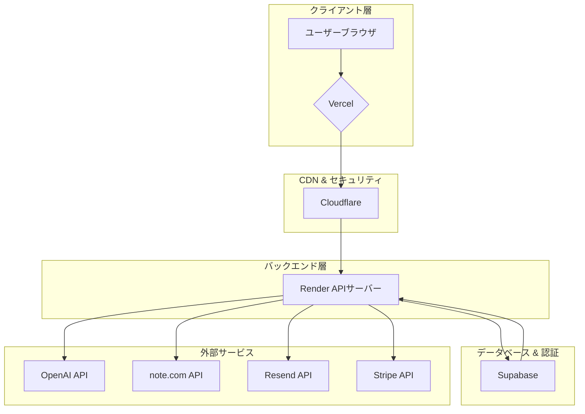
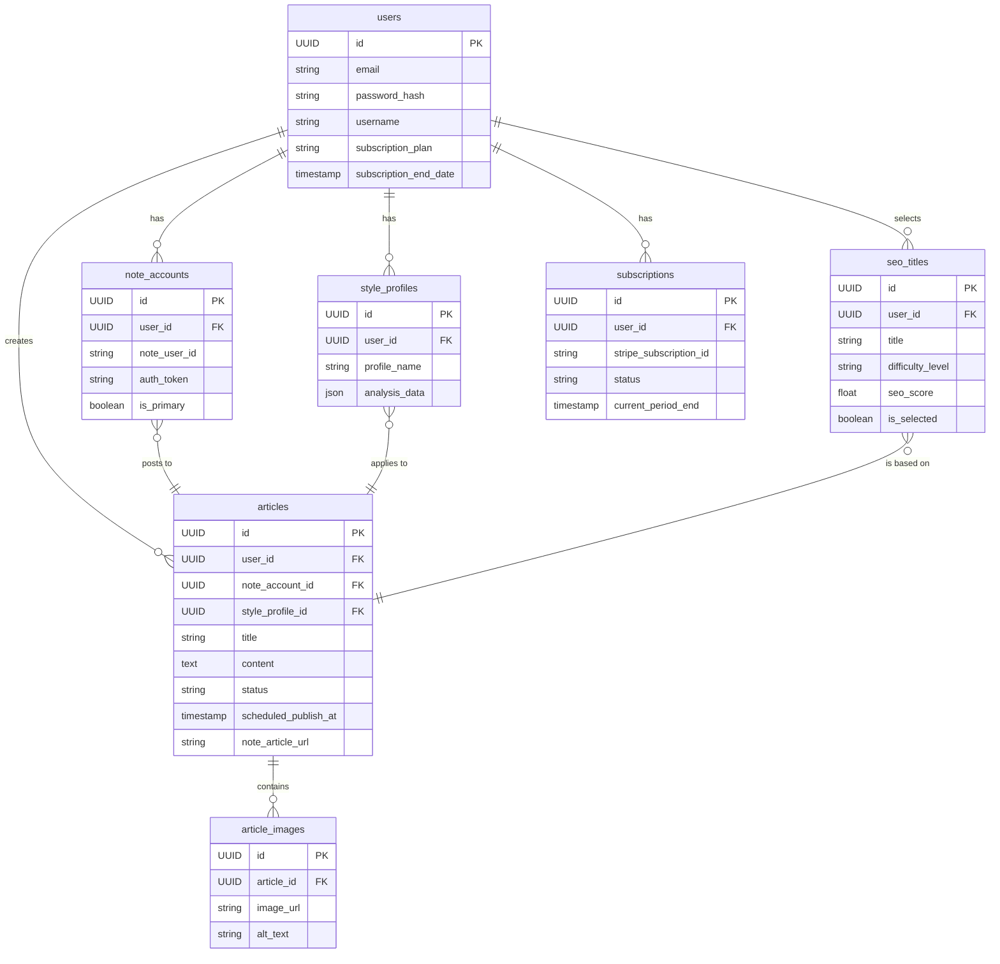
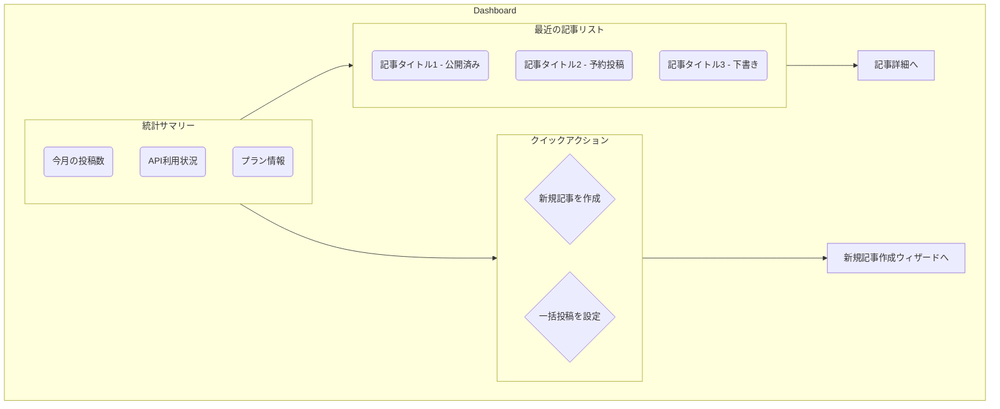
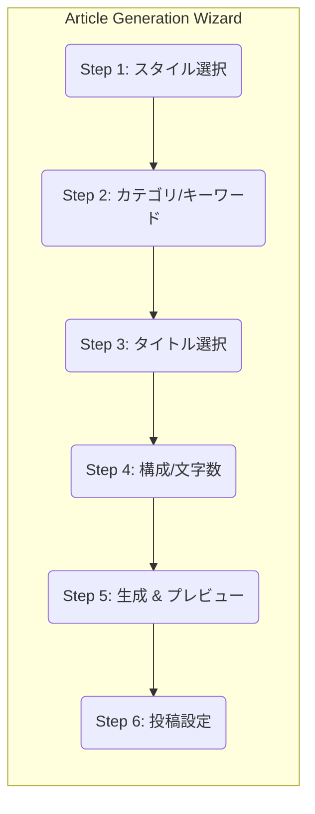
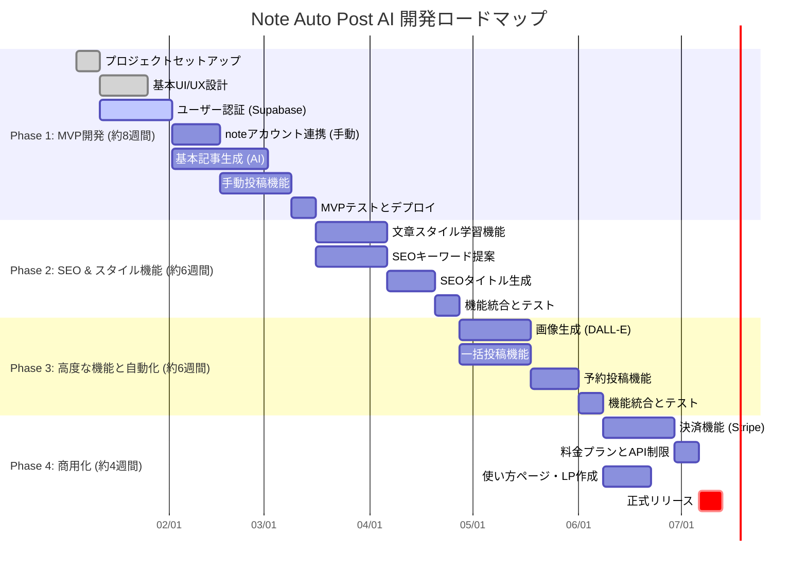

# note自動投稿AIアプリ - 綿密な仕様書

**プロジェクト名**: Note Auto Post AI  
**バージョン**: 1.0  
**作成日**: 2026年1月2日  
**ステータス**: 仕様書作成中

---

## 目次

1. [プロジェクト概要](#プロジェクト概要)
2. [ユーザー要件](#ユーザー要件)
3. [システムアーキテクチャ](#システムアーキテクチャ)
4. [機能仕様](#機能仕様)
5. [データベース設計](#データベース設計)
6. [API設計](#api設計)
7. [UI/UX設計](#uiux設計)
8. [決済・サブスクリプション](#決済サブスクリプション)
9. [セキュリティ](#セキュリティ)
10. [開発ロードマップ](#開発ロードマップ)

---

## プロジェクト概要

### 概要
本プロジェクトは、AIを活用してnoteプラットフォームへの自動投稿を実現するWebアプリケーションです。ユーザーの文章スタイルを学習し、SEO最適化されたコンテンツを自動生成・投稿します。

### ビジネス目標
- ユーザーのコンテンツ作成時間を大幅削減
- SEO対策されたコンテンツの自動生成
- 複数記事の一括投稿機能
- サブスクリプションモデルによる継続的な収益化

### 対象ユーザー
- noteでコンテンツを定期的に発表するクリエイター
- ブログやメディア運営者
- SEO対策を重視するライター

---

## ユーザー要件

### 機能要件

#### 1. アカウント連携機能
- **要件**: ユーザーが使用するnoteアカウントの認証情報を入力し、連携する
- **詳細**:
  - noteアカウント認証（非公式APIを利用したCookie認証）
  - 複数アカウントの管理対応
  - 認証情報（メールアドレス、パスワード）の安全な暗号化保存
- **<span style="color:red;">重要警告</span>**: note.comは公式APIを公開していません。本機能は**ブラウザ自動操作技術**に依存します。これはnote.comの利用規約に抵触する可能性があり、note.com側の仕様変更や対策によって突然利用できなくなるリスク、またはアカウントが制限されるリスクが存在します。しかし、競合サービスであるtsumugiが同様の技術で商用化に成功していることから、note.com側が一定の自動化を容認している可能性も示唆されます。ユーザーにはこれらのリスクと背景を明確に通知し、同意を得る必要があります。

#### 2. 文章スタイル学習機能
- **要件**: ユーザーが過去に書いた記事のURLを貼り付けることで、文章スタイルを学習
- **詳細**:
  - 記事URL入力フォーム
  - 記事内容の自動取得（スクレイピング）
  - テキスト解析（トーン、語彙、文体、文章長など）
  - 学習データの保存
  - 複数記事の学習対応（推奨3～5記事）

#### 3. 文章スタイルカスタマイズ機能
- **要件**: 学習した文章スタイル以外のカスタマイズ可能
- **詳細**:
  - トーン選択（フォーマル、カジュアル、ユーモア、専門的など）
  - 文体調整（短文、長文、混合）
  - 語彙レベル選択（初級、中級、上級）
  - 文章の構成パターン選択

#### 4. SEOキーワード自動選抜機能
- **要件**: ユーザーが選択したカテゴリーを元に、自動的にSEOキーワードを選抜
- **詳細**:
  - カテゴリー選択UI
  - キーワード候補の自動生成（AIベース）
  - 検索ボリュームと競合難易度の分析
  - キーワード提案リストの表示

#### 5. SEOタイトル生成・提示機能
- **要件**: SEOで上位が取れるレベルのタイトルをAIが調査・提示
- **詳細**:
  - 難易度分類（高・中・低）
  - 複数タイトル案の提示（推奨5～10個）
  - 各タイトルの推定難易度スコア表示
  - ユーザーによるタイトル選択

#### 6. 記事構成選択機能
- **要件**: ユーザーが記事の長さを選択
- **詳細**:
  - 長文（6000文字）
  - 中文（4000文字）
  - 短文（2000文字）
  - 各オプションの特徴説明

#### 7. AI記事生成機能
- **要件**: AIが記事を自動生成、見出し・画像も含む
- **詳細**:
  - 選択されたタイトル、カテゴリー、文字数を入力
  - AIモデル（GPT-4など）による記事生成
  - 見出し（H2、H3）の自動挿入
  - 各見出しに対応した画像生成（DALL-E、Midjourney等）
  - 画像のALTテキスト自動生成
  - SEOメタディスクリプション自動生成

#### 8. 下書き保存・承認機能
- **要件**: 生成された記事は下書き保存、ユーザーが承認後に投稿
- **詳細**:
  - 下書き自動保存
  - プレビュー機能
  - 記事内容の編集機能
  - 承認/却下ボタン
  - 修正履歴の保存

#### 9. CTA（Call To Action）統合機能
- **要件**: 全記事にCTAを付与、記事内容に自然に統合
- **詳細**:
  - CTA設定UI（複数テンプレート用意）
  - CTA自動配置（記事の適切な位置に挿入）
  - CTA内容のカスタマイズ
  - CTAリンク管理

#### 10. 複数タイトル一括選択・全自動投稿機能
- **要件**: 最大30タイトルまで一括選択、承認なしで自動投稿
- **詳細**:
  - 複数タイトルの同時選択UI
  - 最大30件までの制限
  - スケジュール投稿オプション
  - 投稿進捗の表示
  - エラーハンドリング

---

## システムアーキテクチャ

### 技術スタック

| 層 | 技術 | 詳細 |
|---|---|---|
| **フロントエンド** | Vite + React + TypeScript + TailwindCSS | ユーザーインターフェース |
| **バックエンド** | Node.js + Express/Fastify | API サーバー |
| **ホスティング＆バックエンド** | Vercel | フロントエンド配信、サーバーレス関数実行 |
| **データベース** | Supabase (PostgreSQL) | ユーザーデータ、記事、設定 |
| **CDN** | Cloudflare / Vercel CDN | 静的コンテンツ配信、セキュリティ |
| **フレームワーク** | Next.js (React) | フロントエンドとバックエンドの統合 ||
| **メール** | Resend | 通知メール送信 |
| **AI API** | OpenAI (GPT-4) | 記事生成、キーワード分析 |
| **画像生成** | DALL-E / Midjourney API | 記事内画像生成 |
| **決済** | Stripe / Paddle | サブスクリプション管理 |

### システム構成図

```
┌─────────────────────────────────────────────────────────────┐
│                     クライアント層                            │
│  ┌──────────────────────────────────────────────────────┐  │
│  │  Vite + React + TypeScript + TailwindCSS            │  │
│  │  - ユーザーインターフェース                           │  │
│  │  - リアルタイム更新                                  │  │
│  └──────────────────────────────────────────────────────┘  │
└─────────────────────────────────────────────────────────────┘
                           ↓
┌─────────────────────────────────────────────────────────────┐
│              Vercel (Hosting & Serverless)                │
│  ┌──────────────────────────┬───────────────────────────┐  │
│  │  Next.js Frontend        │ Vercel Serverless Functions │  │
│  │  - UI (React)            │ - APIエンドポイント (Node.js) │  │
│  │  - 静的サイト生成        │ - ブラウザ自動操作 (Puppeteer)  │  │
│  │                          │ - 外部サービス連携            │  │
│  └──────────────────────────┴───────────────────────────┘  │
└─────────────────────────────────────────────────────────────┘
                           ↓
┌─────────────────────────────────────────────────────────────┐
│                  外部サービス統合層                          │
│  ┌──────────────┬──────────────┬──────────────┐            │
│  │ Supabase     │ OpenAI API   │ note.com API │            │
│  │ (Database)   │ (AI生成)     │ (投稿)       │            │
│  └──────────────┴──────────────┴──────────────┘            │
│  ┌──────────────┬──────────────┬──────────────┐            │
│  │ DALL-E       │ Stripe       │ Resend       │            │
│  │ (画像生成)   │ (決済)       │ (メール)     │            │
│  └──────────────┴──────────────┴──────────────┘            │
└─────────────────────────────────────────────────────────────┘
```

---

## 機能仕様

### 1. ユーザー認証・管理

#### 1.1 サインアップ
- **エンドポイント**: `POST /auth/signup`
- **入力**: メールアドレス、パスワード、ユーザー名
- **処理**:
  - メールアドレスの重複チェック
  - パスワードの強度検証
  - ユーザーレコード作成
  - ウェルカムメール送信（Resend）
- **出力**: ユーザーID、アクセストークン

#### 1.2 ログイン
- **エンドポイント**: `POST /auth/login`
- **入力**: メールアドレス、パスワード
- **処理**:
  - 認証情報の検証
  - JWT トークン生成
- **出力**: アクセストークン、リフレッシュトークン

#### 1.3 パスワードリセット
- **エンドポイント**: `POST /auth/password-reset`
- **入力**: メールアドレス
- **処理**:
  - リセットトークン生成
  - リセットメール送信
- **出力**: 成功メッセージ

### 2. note アカウント連携

#### 2.1 アカウント認証（ブラウザ自動操作ベース）
- **エンドポイント**: `POST /note/authenticate`
- **入力**: noteのメールアドレス、noteのパスワード
- **処理**:
  1. Vercelのサーバーレス関数（Proプラン推奨）でPuppeteerを起動し、note.comのログインページにアクセスします。タイムアウト時間を十分に確保する必要があります。
  2. ユーザーから受け取ったメールアドレスとパスワードを入力し、ログイン処理を実行します。
  3. ログイン成功後、ブラウザからセッションCookieを取得します。
  4. 取得したCookieを強力な暗号化（AES-256など）を施してデータベースの`note_accounts.auth_token`に保存します。
  5. ユーザーのメールアドレスとパスワードは、認証プロセスが完了した後はサーバー上に一切保存しません。
- **出力**: 認証成功/失敗ステータス
- **<span style="color:red;">セキュリティ警告</span>**: ユーザーの認証情報を直接扱うため、最高レベルのセキュリティ対策が必須です。通信はすべてTLSで暗号化し、データベースへのアクセスも厳格に制限する必要があります。

#### 2.2 複数アカウント管理
- **エンドポイント**: `GET /note/accounts`, `DELETE /note/accounts/{id}`
- **処理**:
  - 複数アカウントの登録・削除
  - アカウント切り替え

### 3. 文章スタイル学習

#### 3.1 記事URL入力・学習
- **エンドポイント**: `POST /learning/analyze-articles`
- **入力**: 記事URL配列
- **処理**:
  1. 各URLから記事内容を取得（Puppeteer/Cheerio）
  2. テキスト解析:
     - 平均文字数、平均文数
     - 使用語彙の分析
     - 文体パターン（敬語、カジュアル度）
     - 句読点の使用頻度
     - 段落構成
  3. 学習データの保存
  4. スタイルプロフィール生成
- **出力**: スタイル分析結果

#### 3.2 学習データの管理
- **エンドポイント**: `GET /learning/style-profile`, `PUT /learning/style-profile`
- **処理**:
  - スタイルプロフィールの取得・更新
  - 複数スタイルの保存

### 4. SEO キーワード分析

#### 4.1 カテゴリー選択
- **エンドポイント**: `GET /seo/categories`
- **出力**: カテゴリーリスト

#### 4.2 キーワード自動生成
- **エンドポイント**: `POST /seo/generate-keywords`
- **入力**: カテゴリー、オプションキーワード
- **処理**:
  1. GPT-4 を使用してキーワード候補を生成
  2. 各キーワードの検索ボリューム推定（外部API利用）
  3. 競合難易度スコア計算
  4. ランキング
- **出力**: キーワード候補リスト（スコア付き）

### 5. SEO タイトル生成

#### 5.1 タイトル候補生成
- **エンドポイント**: `POST /seo/generate-titles`
- **入力**: キーワード、カテゴリー、難易度フィルタ
- **処理**:
  1. GPT-4 でタイトル案を複数生成
  2. 各タイトルの難易度スコア計算
  3. 難易度分類（高・中・低）
  4. SEO スコア計算
- **出力**: タイトル候補リスト（5～10個）

#### 5.2 タイトル選択
- **エンドポイント**: `POST /articles/select-titles`
- **入力**: 選択されたタイトルID配列（最大30個）
- **処理**:
  - 選択されたタイトルの保存
  - 記事生成キューに追加
- **出力**: 記事生成開始通知

### 6. 記事生成

#### 6.1 記事構成選択
- **エンドポイント**: `POST /articles/generate`
- **入力**:
  - タイトル
  - カテゴリー
  - 文字数（2000/4000/6000）
  - スタイルプロフィール
  - CTA設定
- **処理**:
  1. プロンプト生成
  2. GPT-4 で記事本文を生成
  3. 見出し（H2、H3）を自動挿入
  4. 各見出しに対応した画像生成指示を作成
  5. DALL-E で画像生成
  6. 画像のALTテキスト生成
  7. メタディスクリプション生成
  8. CTA を自然に統合
  9. 下書き保存
- **出力**: 下書き記事ID、プレビューURL

#### 6.2 記事プレビュー・編集
- **エンドポイント**: `GET /articles/{id}`, `PUT /articles/{id}`
- **処理**:
  - 記事内容の表示
  - 編集・修正
  - 修正履歴保存

### 7. 記事投稿

#### 7.1 単一記事投稿
- **エンドポイント**: `POST /articles/{id}/publish`
- **処理**:
  1. 記事内容の最終確認
  2. データベースから暗号化されたCookieを取得し、復号します。
  3. 復号したCookieを使用して、ヘッドレスブラウザを操作し、note.comの投稿ページにアクセスします。
  4. 記事のタイトル、本文、画像などをフォームに入力し、投稿ボタンをクリックします。
5. 投稿成功後、アプリケーション内の記事ステータスを`published`に更新し、note.com上の記事URLを保存します。
  5. ユーザーに投稿完了通知メールを送信します。
- **出力**: 投稿状態、note記事URL

#### 7.2 一括投稿
- **エンドポイント**: `POST /articles/bulk-publish`
- **入力**: 記事ID配列、スケジュール設定
- **処理**:
  1. 各記事の投稿スケジュール設定
  2. 非同期投稿実行
  3. 進捗トラッキング
  4. エラーハンドリング
- **出力**: 投稿進捗情報

---

## データベース設計

### テーブル一覧

#### users テーブル
```sql
CREATE TABLE users (
  id UUID PRIMARY KEY DEFAULT gen_random_uuid(),
  email VARCHAR(255) UNIQUE NOT NULL,
  password_hash VARCHAR(255) NOT NULL,
  username VARCHAR(100) UNIQUE NOT NULL,
  profile_picture_url TEXT,
  subscription_plan VARCHAR(50) DEFAULT 'free',
  subscription_start_date TIMESTAMP,
  subscription_end_date TIMESTAMP,
  api_quota_monthly INT DEFAULT 0,
  api_quota_used INT DEFAULT 0,
  created_at TIMESTAMP DEFAULT CURRENT_TIMESTAMP,
  updated_at TIMESTAMP DEFAULT CURRENT_TIMESTAMP,
  deleted_at TIMESTAMP
);
```

#### note_accounts テーブル
```sql
CREATE TABLE note_accounts (
  id UUID PRIMARY KEY DEFAULT gen_random_uuid(),
  user_id UUID NOT NULL REFERENCES users(id) ON DELETE CASCADE,
  note_user_id VARCHAR(255) NOT NULL,
  note_username VARCHAR(255),
  auth_token VARCHAR(1000) NOT NULL ENCRYPTED,
  is_primary BOOLEAN DEFAULT false,
  last_synced_at TIMESTAMP,
  created_at TIMESTAMP DEFAULT CURRENT_TIMESTAMP,
  updated_at TIMESTAMP DEFAULT CURRENT_TIMESTAMP,
  UNIQUE(user_id, note_user_id)
);
```

#### style_profiles テーブル
```sql
CREATE TABLE style_profiles (
  id UUID PRIMARY KEY DEFAULT gen_random_uuid(),
  user_id UUID NOT NULL REFERENCES users(id) ON DELETE CASCADE,
  profile_name VARCHAR(100),
  tone VARCHAR(50), -- formal, casual, humor, professional
  text_style VARCHAR(50), -- short, long, mixed
  vocabulary_level VARCHAR(50), -- beginner, intermediate, advanced
  average_sentence_length INT,
  average_paragraph_length INT,
  punctuation_frequency FLOAT,
  formal_language_ratio FLOAT,
  learning_articles JSONB, -- 学習に使用した記事URL
  created_at TIMESTAMP DEFAULT CURRENT_TIMESTAMP,
  updated_at TIMESTAMP DEFAULT CURRENT_TIMESTAMP
);
```

#### articles テーブル
```sql
CREATE TABLE articles (
  id UUID PRIMARY KEY DEFAULT gen_random_uuid(),
  user_id UUID NOT NULL REFERENCES users(id) ON DELETE CASCADE,
  note_account_id UUID REFERENCES note_accounts(id),
  title VARCHAR(255) NOT NULL,
  category VARCHAR(100),
  content TEXT NOT NULL,
  word_count INT,
  style_profile_id UUID REFERENCES style_profiles(id),
  seo_keywords JSONB,
  seo_difficulty_score FLOAT,
  meta_description VARCHAR(160),
  cta_content TEXT,
  status VARCHAR(50) DEFAULT 'draft', -- draft, published, scheduled
  published_at TIMESTAMP,
  scheduled_publish_at TIMESTAMP,
  note_article_url VARCHAR(500),
  note_article_id VARCHAR(255),
  created_at TIMESTAMP DEFAULT CURRENT_TIMESTAMP,
  updated_at TIMESTAMP DEFAULT CURRENT_TIMESTAMP
);
```

#### article_images テーブル
```sql
CREATE TABLE article_images (
  id UUID PRIMARY KEY DEFAULT gen_random_uuid(),
  article_id UUID NOT NULL REFERENCES articles(id) ON DELETE CASCADE,
  heading_id VARCHAR(100), -- 対応する見出しID
  image_url VARCHAR(500),
  alt_text VARCHAR(255),
  image_prompt TEXT,
  generated_by VARCHAR(50), -- dalle, midjourney
  created_at TIMESTAMP DEFAULT CURRENT_TIMESTAMP
);
```

#### keywords テーブル
```sql
CREATE TABLE keywords (
  id UUID PRIMARY KEY DEFAULT gen_random_uuid(),
  keyword VARCHAR(255) NOT NULL,
  category VARCHAR(100),
  search_volume INT,
  competition_difficulty FLOAT, -- 0-100
  trend_score FLOAT,
  created_at TIMESTAMP DEFAULT CURRENT_TIMESTAMP,
  updated_at TIMESTAMP DEFAULT CURRENT_TIMESTAMP,
  UNIQUE(keyword, category)
);
```

#### seo_titles テーブル
```sql
CREATE TABLE seo_titles (
  id UUID PRIMARY KEY DEFAULT gen_random_uuid(),
  user_id UUID NOT NULL REFERENCES users(id) ON DELETE CASCADE,
  title VARCHAR(255) NOT NULL,
  keywords JSONB,
  difficulty_level VARCHAR(50), -- high, medium, low
  difficulty_score FLOAT, -- 0-100
  seo_score FLOAT, -- 0-100
  estimated_search_volume INT,
  is_selected BOOLEAN DEFAULT false,
  created_at TIMESTAMP DEFAULT CURRENT_TIMESTAMP
);
```

#### subscriptions テーブル
```sql
CREATE TABLE subscriptions (
  id UUID PRIMARY KEY DEFAULT gen_random_uuid(),
  user_id UUID NOT NULL REFERENCES users(id) ON DELETE CASCADE,
  plan_id VARCHAR(100) NOT NULL,
  stripe_subscription_id VARCHAR(255),
  status VARCHAR(50), -- active, canceled, past_due
  current_period_start TIMESTAMP,
  current_period_end TIMESTAMP,
  cancel_at_period_end BOOLEAN DEFAULT false,
  created_at TIMESTAMP DEFAULT CURRENT_TIMESTAMP,
  updated_at TIMESTAMP DEFAULT CURRENT_TIMESTAMP
);
```

#### api_logs テーブル
```sql
CREATE TABLE api_logs (
  id UUID PRIMARY KEY DEFAULT gen_random_uuid(),
  user_id UUID NOT NULL REFERENCES users(id) ON DELETE CASCADE,
  endpoint VARCHAR(255),
  method VARCHAR(10),
  status_code INT,
  response_time_ms INT,
  error_message TEXT,
  created_at TIMESTAMP DEFAULT CURRENT_TIMESTAMP
);
```

---

## API設計

### 認証エンドポイント

| メソッド | エンドポイント | 説明 |
|---------|---|---|
| POST | `/auth/signup` | ユーザー登録 |
| POST | `/auth/login` | ログイン |
| POST | `/auth/logout` | ログアウト |
| POST | `/auth/refresh` | トークンリフレッシュ |
| POST | `/auth/password-reset` | パスワードリセット |
| GET | `/auth/me` | 現在のユーザー情報 |

### note アカウント管理エンドポイント

| メソッド | エンドポイント | 説明 |
|---------|---|---|
| POST | `/note/authenticate` | note アカウント認証 |
| GET | `/note/accounts` | 連携済みアカウント一覧 |
| DELETE | `/note/accounts/{id}` | アカウント削除 |
| PUT | `/note/accounts/{id}/set-primary` | プライマリアカウント設定 |

### 文章スタイル学習エンドポイント

| メソッド | エンドポイント | 説明 |
|---------|---|---|
| POST | `/learning/analyze-articles` | 記事分析・学習 |
| GET | `/learning/style-profiles` | スタイルプロフィール一覧 |
| GET | `/learning/style-profiles/{id}` | スタイルプロフィール詳細 |
| PUT | `/learning/style-profiles/{id}` | スタイルプロフィール更新 |
| DELETE | `/learning/style-profiles/{id}` | スタイルプロフィール削除 |

### SEO キーワード・タイトル生成エンドポイント

| メソッド | エンドポイント | 説明 |
|---------|---|---|
| GET | `/seo/categories` | カテゴリー一覧 |
| POST | `/seo/generate-keywords` | キーワード生成 |
| POST | `/seo/generate-titles` | タイトル生成 |
| GET | `/seo/titles/{id}` | タイトル詳細 |

### 記事管理エンドポイント

| メソッド | エンドポイント | 説明 |
|---------|---|---|
| POST | `/articles` | 記事作成 |
| GET | `/articles` | 記事一覧 |
| GET | `/articles/{id}` | 記事詳細 |
| PUT | `/articles/{id}` | 記事更新 |
| DELETE | `/articles/{id}` | 記事削除 |
| POST | `/articles/{id}/publish` | 記事投稿 |
| POST | `/articles/bulk-publish` | 一括投稿 |
| GET | `/articles/{id}/preview` | 記事プレビュー |

### サブスクリプション管理エンドポイント

| メソッド | エンドポイント | 説明 |
|---------|---|---|
| GET | `/subscriptions/plans` | プラン一覧 |
| POST | `/subscriptions/create` | サブスクリプション作成 |
| GET | `/subscriptions/current` | 現在のサブスクリプション |
| POST | `/subscriptions/cancel` | サブスクリプション解約 |

---

## UI/UX設計

### 主要ページ構成

#### 1. ダッシュボード
- ユーザーの統計情報表示
- 最近の記事一覧
- クイックアクション（新規記事作成、投稿予定など）

#### 2. 記事生成ウィザード
- ステップ1: note アカウント選択
- ステップ2: 記事スタイル設定
- ステップ3: カテゴリー・キーワード選択
- ステップ4: タイトル選択
- ステップ5: 記事構成選択
- ステップ6: 記事生成・プレビュー
- ステップ7: 承認・投稿

#### 3. 記事管理ページ
- 記事一覧（ステータスフィルタ）
- 記事詳細・編集
- 投稿スケジュール管理

#### 4. 設定ページ
- プロフィール設定
- note アカウント管理
- スタイルプロフィール管理
- サブスクリプション管理

---

## 決済・サブスクリプション

### プラン設計

| プラン | 月額 | 月間記事数 | 機能 |
|---|---|---|---|
| **Free** | ¥0 | 5 | 基本機能 |
| **Pro** | ¥2,980 | 30 | 全機能 + 優先サポート |
| **Enterprise** | 要相談 | 無制限 | カスタマイズ + 専任サポート |

### 決済フロー
- Stripe を使用したサブスクリプション管理
- 月次自動課金
- キャンセル時の日割り計算

---

## セキュリティ

### 認証・認可
- JWT トークンベース認証
- リフレッシュトークンの実装
- CORS 設定

### データ保護
- パスワードのハッシング（bcrypt）
- note API トークンの暗号化保存
- HTTPS 通信の強制

### API セキュリティ
- レート制限
- API キー認証
- リクエスト署名検証

---

## 開発ロードマップ

### Phase 1: MVP (2～3ヶ月)
- ユーザー認証
- note アカウント連携
- 基本的な記事生成
- 単一記事投稿

### Phase 2: SEO 機能 (1～2ヶ月)
- キーワード分析
- タイトル生成
- SEO スコア表示

### Phase 3: 高度な機能 (1～2ヶ月)
- 文章スタイル学習
- 一括投稿
- 画像生成統合

### Phase 4: 商用化 (1ヶ月)
- サブスクリプション実装
- 決済統合
- ユーザーサポート

---

**このドキュメントは継続的に更新されます。**


---

## 技術スタック詳細

### フロントエンド

#### Vite + React + TypeScript + TailwindCSS
- **Vite**: 高速開発サーバーとビルド
- **React 18**: UI フレームワーク
- **TypeScript**: 型安全性
- **TailwindCSS**: ユーティリティファースト CSS フレームワーク
- **React Router**: ページナビゲーション
- **Zustand**: 状態管理
- **React Query**: サーバー状態管理
- **Axios**: HTTP クライアント

### バックエンド

#### Node.js + Express/Fastify
- **Node.js 20 LTS**: ランタイム
- **Express**: Web フレームワーク
- **TypeScript**: 型安全性
- **Prisma**: ORM
- **Zod**: スキーマバリデーション
- **JWT**: 認証

### データベース

#### Supabase (PostgreSQL)
- **PostgreSQL 15**: リレーショナルデータベース
- **Supabase Auth**: ユーザー認証
- **Supabase Storage**: ファイル保存
- **Supabase Realtime**: リアルタイム更新

### 外部サービス統合

#### OpenAI API
- **GPT-4**: テキスト生成、分析
- **DALL-E 3**: 画像生成
- **料金**: GPT-4 入力 $0.03/1K トークン、出力 $0.06/1K トークン

#### Resend
- **Email API**: トランザクショナルメール送信
- **料金**: 月額 $20 ～

#### Stripe
- **Subscription Management**: サブスクリプション管理
- **Payment Processing**: 決済処理

---

## 開発フロー

### ローカル開発セットアップ
```bash
git clone https://github.com/yourusername/note-auto-post.git
cd note-auto-post
pnpm install
cp .env.example .env.local
pnpm run db:migrate
pnpm run dev
```

### デプロイメントフロー
1. ローカルでテスト
2. Git にプッシュ
3. プルリクエスト作成
4. マージ
5. 自動デプロイ（Vercel + Render）

---

**本仕様書は継続的に更新・改善されます。**


---

## システムアーキテクチャ

### 構成図



### コンポーネント詳細

| コンポーネント | 役割 |
|---|---|
| **Vercel** | フロントエンドのホスティングとデプロイ。Next.js/Reactアプリケーションをグローバルに配信。 |
| **Cloudflare** | CDN、DNS、セキュリティ（WAF、DDoS対策）を提供。Vercelと連携し、高速で安全なコンテンツ配信を実現。 |
| **Render** | バックエンドAPIサーバーのホスティング。Node.jsアプリケーションを実行し、スケーラブルな環境を提供。 |
| **Supabase** | PostgreSQLデータベース、認証、ストレージを提供。バックエンドのデータ永続化とユーザー管理を担当。 |
| **OpenAI API** | 記事の自動生成、文章スタイルの解析、SEOキーワードの提案など、AI関連機能を提供。 |
| **note.com API** | 生成された記事の自動投稿。公式APIが存在しないため、非公式APIまたはWebスクレイピング/ブラウザ自動化による実装を検討。 |
| **Resend** | ユーザー登録時のウェルカムメール、投稿完了通知など、トランザクショナルメールの送信。 |
| **Stripe** | サブスクリプション決済の処理と管理。 |

---


---

## 機能仕様詳細

### 1. ユーザー認証・管理 (Supabase Auth)

- **サインアップ**: メールアドレスとパスワードによる登録。確認メールをResend経由で送信。
- **ログイン**: JWTを利用したセッション管理。
- **パスワードリセット**: パスワードリセットリンクをメールで送信。
- **ソーシャルログイン**: Google、GitHubアカウントでのログイン機能を提供。

### 2. noteアカウント連携

- **認証**: note.comの認証情報を安全に保存。OAuth 2.0が利用できない場合、ユーザーにアクセストークンの手動入力を求める。その際の取得方法はヘルプページで図解する。
- **複数アカウント管理**: ユーザーは複数のnoteアカウントを登録・切り替え可能。

### 3. 文章スタイル学習

- **記事取得**: ユーザーが入力したnote記事URLから、PuppeteerまたはCheerioを使用して記事本文をスクレイピング。
- **テキスト分析**: 取得したテキストを自然言語処理ライブラリ（compromise, nlp.jsなど）で分析。以下の項目を抽出・数値化し、スタイルプロファイルとして保存。
    - 平均文長・段落長
    - 漢字・ひらがな・カタカナの比率
    - 使用頻度の高い単語トップ50
    - 文末表現（です・ます調、だ・である調など）の傾向
- **カスタムスタイル**: 事前定義されたスタイル（例：「専門家風」「親しみやすいブログ風」）からも選択可能。

### 4. SEOキーワード・タイトル生成

- **キーワード提案**: ユーザーが入力したカテゴリに基づき、OpenAI API(GPT-4)を用いて関連キーワードを50個提案。
- **難易度分析**: 提案されたキーワードに対し、外部のSEO分析API（Ahrefs, SEMrushなど、利用可能なAPIを調査・契約）をコールし、検索ボリュームと競合性を取得。3段階（高・中・低）の難易度に分類。
- **タイトル生成**: ユーザーが選択したキーワードに基づき、クリック率が高まるような心理的トリガー（数字を入れる、限定性を出すなど）を組み込んだタイトル案をOpenAI APIで10個生成。各タイトル案にSEO難易度を表示。

### 5. 記事生成

- **構成作成**: 選択されたタイトルと文字数に基づき、まず記事全体の構成（見出しの階層構造）をAIが作成。
- **本文執筆**: 構成に沿って、各セクションの本文をAIが執筆。ユーザーの文章スタイルプロファイルを反映。
- **画像生成**: 各見出しの内容に合った画像をDALL-E 3で生成。画像プロンプトはAIが自動生成。
- **CTA統合**: ユーザーが事前に設定したCTA（商品リンク、メルマガ登録など）に自然につながるように、記事の結論部分をAIが調整。

### 6. 記事の承認と投稿

- **下書きとプレビュー**: 生成された記事はまずシステム内のデータベースに下書きとして保存。ユーザーは専用画面でプレビュー・編集が可能。
- **投稿処理**: ユーザーが「投稿」ボタンを押すと、バックエンドのジョブキュー（BullMQなど）に投稿タスクが追加される。
- **noteへの投稿**: バックグラウンドでPuppeteerを起動し、note.comにログインして記事を投稿。公式APIが利用できない場合の代替策。
- **一括投稿**: 複数の記事が選択された場合、指定された投稿間隔（例：1日おき）でスケジュール投稿ジョブをキューに追加。

### 7. 決済とサブスクリプション (Stripe)

- **プラン**: Free, Pro, Enterpriseの3プランを提供。
- **決済**: Stripe Checkoutを使用した月額・年額のサブスクリプション決済。
- **機能制限**: ユーザーのプランに応じて、月間記事生成数や一括投稿の上限などを制御。
- **ポータル**: Stripe Customer Portalを導入し、ユーザー自身でプラン変更や解約、支払い方法の更新ができるようにする。

---


---

## データベース設計 (ER図)



### テーブル定義詳細

#### `users`
ユーザーの基本情報を格納します。

| カラム名 | 型 | 説明 |
|---|---|---|
| `id` | UUID | 主キー |
| `email` | VARCHAR | ログイン用のメールアドレス。一意。 |
| `password_hash` | VARCHAR | ハッシュ化されたパスワード。 |
| `username` | VARCHAR | 表示名。 |
| `stripe_customer_id` | VARCHAR | Stripeの顧客ID。決済情報と紐付け。 |
| `subscription_plan` | VARCHAR | 現在のサブスクリプションプラン（free, pro, enterprise）。 |
| `subscription_status` | VARCHAR | 購読ステータス（active, canceled, past_due）。 |
| `api_quota_used` | INT | 当月のAPI利用回数。プランの上限管理に使用。 |
| `created_at` | TIMESTAMP | 作成日時 |

#### `note_accounts`
ユーザーが連携したnoteアカウント情報を格納します。

| カラム名 | 型 | 説明 |
|---|---|---|
| `id` | UUID | 主キー |
| `user_id` | UUID | `users`テーブルへの外部キー。 |
| `note_user_id` | VARCHAR | noteのアカウントID。 |
| `auth_token` | VARCHAR | noteへの投稿に使用する認証トークン。暗号化して保存。 |
| `is_primary` | BOOLEAN | 複数のnoteアカウントを連携した場合のデフォルトアカウント。 |

#### `style_profiles`
文章スタイル学習の結果を格納します。

| カラム名 | 型 | 説明 |
|---|---|---|
| `id` | UUID | 主キー |
| `user_id` | UUID | `users`テーブルへの外部キー。 |
| `profile_name` | VARCHAR | ユーザーが設定するプロファイル名。 |
| `source_urls` | JSONB | 学習に使用したnote記事のURLリスト。 |
| `analysis_data` | JSONB | テキスト分析結果（平均文長、単語頻度など）をJSON形式で格納。 |

#### `articles`
AIが生成した記事の情報を格納します。

| カラム名 | 型 | 説明 |
|---|---|---|
| `id` | UUID | 主キー |
| `user_id` | UUID | `users`テーブルへの外部キー。 |
| `note_account_id` | UUID | 投稿先の`note_accounts`テーブルへの外部キー。 |
| `style_profile_id` | UUID | 適用した`style_profiles`テーブルへの外部キー。 |
| `title` | VARCHAR | 記事のタイトル。 |
| `content` | TEXT | 記事の本文（Markdown形式）。 |
| `status` | VARCHAR | 記事の状態（draft, scheduled, published, error）。 |
| `word_count` | INT | 文字数。 |
| `seo_keywords` | JSONB | 記事に関連するSEOキーワード。 |
| `meta_description` | VARCHAR | SEO用のメタディスクリプション。 |
| `cta_id` | UUID | `ctas`テーブルへの外部キー。 |
| `scheduled_publish_at` | TIMESTAMP | 予約投稿の日時。 |
| `note_article_url` | VARCHAR | 投稿後のnote記事URL。 |

#### `article_images`
記事に挿入される生成画像の情報を格納します。

| カラム名 | 型 | 説明 |
|---|---|---|
| `id` | UUID | 主キー |
| `article_id` | UUID | `articles`テーブルへの外部キー。 |
| `image_url` | VARCHAR | 生成された画像のURL（Supabase Storageなど）。 |
| `alt_text` | VARCHAR | SEOのためのaltテキスト。 |
| `image_prompt` | TEXT | 画像生成時に使用したプロンプト。 |

#### `ctas` (Call To Action)
ユーザーが設定するCTAの情報を格納します。

| カラム名 | 型 | 説明 |
|---|---|---|
| `id` | UUID | 主キー |
| `user_id` | UUID | `users`テーブルへの外部キー。 |
| `cta_name` | VARCHAR | CTAの管理名。 |
| `cta_content` | TEXT | CTAの本文（HTMLまたはMarkdown）。 |
| `cta_link` | VARCHAR | CTAに含めるリンクURL。 |

---


---

## API設計

RESTful APIとして設計し、主要なリソースごとにエンドポイントを整理します。

### 認証 (`/auth`)

| メソッド | エンドポイント | 説明 | リクエストボディ | レスポンス例 |
|---|---|---|---|---|
| POST | `/signup` | 新規ユーザー登録 | `{ email, password, username }` | `{ userId, accessToken }` |
| POST | `/login` | ログイン | `{ email, password }` | `{ accessToken, refreshToken }` |
| POST | `/logout` | ログアウト | - | `{ message: 'Logged out' }` |
| POST | `/refresh` | アクセストークン更新 | `{ refreshToken }` | `{ accessToken }` |
| GET | `/me` | 認証ユーザー情報取得 | - | `{ userId, email, username, ... }` |

### noteアカウント管理 (`/note-accounts`)

| メソッド | エンドポイント | 説明 | リクエストボディ | レスポンス例 |
|---|---|---|---|---|
| GET | `/` | 連携済みアカウント一覧 | - | `[ { id, note_user_id, is_primary }, ... ]` |
| POST | `/` | 新規アカウント連携 | `{ note_user_id, auth_token }` | `{ id, note_user_id }` |
| DELETE | `/{id}` | アカウント連携解除 | - | `{ message: 'Account deleted' }` |
| PUT | `/{id}/primary` | プライマリアカウント設定 | - | `{ message: 'Primary account set' }` |

### 文章スタイルプロファイル (`/style-profiles`)

| メソッド | エンドポイント | 説明 | リクエストボディ | レスポンス例 |
|---|---|---|---|---|
| GET | `/` | プロファイル一覧取得 | - | `[ { id, profile_name }, ... ]` |
| POST | `/` | 新規プロファイル作成（URLから学習） | `{ profile_name, source_urls: [...] }` | `{ id, profile_name, analysis_data }` |
| GET | `/{id}` | プロファイル詳細取得 | - | `{ id, profile_name, analysis_data }` |
| PUT | `/{id}` | プロファイル更新 | `{ profile_name, ... }` | `{ id, profile_name, ... }` |
| DELETE | `/{id}` | プロファイル削除 | - | `{ message: 'Profile deleted' }` |

### SEO & コンテンツ生成 (`/contents`)

| メソッド | エンドポイント | 説明 | リクエストボディ | レスポンス例 |
|---|---|---|---|---|
| POST | `/keywords` | キーワード提案 | `{ category }` | `[ { keyword, volume, difficulty }, ... ]` |
| POST | `/titles` | タイトル提案 | `{ keyword }` | `[ { title, seo_score, difficulty }, ... ]` |
| POST | `/generate-article` | 記事生成 | `{ title, word_count, style_profile_id, ... }` | `{ article_id, content, images }` |

### 記事管理 (`/articles`)

| メソッド | エンドポイント | 説明 | リクエストボディ | レスポンス例 |
|---|---|---|---|---|
| GET | `/` | 記事一覧取得（フィルタ・ページネーション対応） | - | `{ articles: [...], totalPages }` |
| GET | `/{id}` | 記事詳細取得 | - | `{ id, title, content, status, ... }` |
| PUT | `/{id}` | 記事更新 | `{ title, content }` | `{ id, title, content, ... }` |
| DELETE | `/{id}` | 記事削除 | - | `{ message: 'Article deleted' }` |
| POST | `/{id}/publish` | 記事をnoteに投稿 | `{ publish_at (optional) }` | `{ status: 'publishing', note_article_url }` |

### CTA管理 (`/ctas`)

| メソッド | エンドポイント | 説明 | リクエストボディ | レスポンス例 |
|---|---|---|---|---|
| GET | `/` | CTA一覧取得 | - | `[ { id, cta_name }, ... ]` |
| POST | `/` | 新規CTA作成 | `{ cta_name, cta_content, cta_link }` | `{ id, cta_name }` |
| PUT | `/{id}` | CTA更新 | `{ cta_name, cta_content, cta_link }` | `{ id, cta_name, ... }` |
| DELETE | `/{id}` | CTA削除 | - | `{ message: 'CTA deleted' }` |

### 決済・サブスクリプション (`/subscriptions`)

| メソッド | エンドポイント | 説明 | リクエストボディ | レスポンス例 |
|---|---|---|---|---|
| GET | `/plans` | 料金プラン一覧取得 | - | `[ { plan_id, name, price }, ... ]` |
| POST | `/checkout` | 決済セッション作成 | `{ plan_id }` | `{ sessionId }` |
| GET | `/` | 現在の購読情報取得 | - | `{ plan, status, current_period_end }` |
| POST | `/portal` | カスタマーポータルセッション作成 | - | `{ portalUrl }` |

---


---

## UI/UX設計

### 設計思想
- **シンプル & 直感的**: ユーザーが迷うことなく操作できるよう、クリーンでミニマルなデザインを採用します。
- **ウィザード形式**: 記事生成プロセスをステップ・バイ・ステップのウィザード形式にすることで、複雑な設定も簡単に行えるようにします。
- **ダッシュボード中心**: ログイン後のダッシュボードで、現在の状況（生成中の記事、投稿済みの記事、API使用量など）が一目でわかるようにします。
- **レスポンシブデザイン**: デスクトップ、タブレット、スマートフォンの各デバイスに最適化された表示を提供します。

### ワイヤーフレーム

#### 1. ダッシュボード


#### 2. 記事生成ウィザード


- **Step 1: スタイル選択**: 連携したnoteアカウントまたは保存済みの文章スタイルプロファイルを選択。
- **Step 2: カテゴリ/キーワード**: 記事のカテゴリを入力し、AIが提案するSEOキーワードを選択。
- **Step 3: タイトル選択**: AIが生成した複数のタイトル案から、投稿したいものを1つまたは複数選択（一括投稿の場合）。
- **Step 4: 構成/文字数**: 記事の長さ（短文/中文/長文）を選択。
- **Step 5: 生成 & プレビュー**: AIが記事を生成。Markdownエディタで内容を確認・編集。
- **Step 6: 投稿設定**: 「すぐに投稿」または「予約投稿」を選択し、投稿先のnoteアカウントを指定。

#### 3. 記事管理ページ
- **レイアウト**: テーブル形式で記事一覧を表示。
- **カラム**: 記事タイトル, ステータス, 投稿日, note.comリンク, アクション（編集/削除/再投稿）。
- **機能**: ステータス（下書き, 予約済み, 公開済み）によるフィルタリング機能、タイトルでの検索機能。

#### 4. 設定ページ
- **タブ構成**: 「プロフィール」「noteアカウント連携」「文章スタイル」「サブスクリプション」「CTA設定」のタブで各設定項目を分類。
- **noteアカウント連携**: 連携済みアカウントの一覧表示と、新規アカウント追加フォーム。
- **文章スタイル**: 保存済みスタイルプロファイルの一覧と、新規作成（URL入力）フォーム。
- **サブスクリプション**: 現在のプラン表示と、Stripeカスタマーポータルへのリンク。

### コンポーネント設計
- **Atoms**: ボタン、インプット、ラベルなど最小単位のコンポーネント。
- **Molecules**: 検索フォーム（インプット+ボタン）など、Atomsを組み合わせたコンポーネント。
- **Organisms**: ヘッダー、サイドバー、記事カードなど、より複雑なUIパーツ。
- **Templates**: 各ページの基本的なレイアウト構造。
- **Pages**: Templatesに実際のデータを流し込んだ最終的なページ。

上記のアトミックデザインのアプローチに基づき、再利用可能でメンテナンス性の高いコンポーネントを構築します。

---


---

## 8. 決済・サブスクリプション設計

### 決済プロバイダー
- **Stripe**: サブスクリプション管理、決済処理、請求書発行など、包括的な決済機能を提供するため、Stripeを全面的に採用します。

### 料金プラン
ユーザーの多様なニーズに応えるため、3つの主要なプランを設けます。

| プラン名 | 月額料金（税込） | 年額料金（税込） | 月間記事生成数 | 主な機能 |
|---|---|---|---|---|
| **Free** | ¥0 | - | 5記事 | 基本的な記事生成、1つのnoteアカウント連携 |
| **Pro** | ¥2,980 | ¥29,800 (2ヶ月分お得) | 50記事 | 全機能（文章スタイル学習、一括投稿、画像生成）、複数アカウント連携、優先サポート |
| **Enterprise** | 要相談 | 要相談 | 無制限 | 全機能に加え、専任のサポート担当、機能カスタマイズ、オンボーディング支援 |

### 決済フロー

1.  **プラン選択**: ユーザーは料金ページで希望のプランを選択します。
2.  **Stripe Checkout**: 「アップグレード」ボタンをクリックすると、Stripeがホストする決済ページ（Stripe Checkout）にリダイレクトされます。ここでユーザーはクレジットカード情報などを安全に入力します。
3.  **決済完了**: 決済が成功すると、StripeからWebhookイベント（`checkout.session.completed`）がバックエンドサーバーに送信されます。
4.  **アカウント更新**: Webhookを受信したサーバーは、`users`テーブルと`subscriptions`テーブルを更新し、ユーザーのプランとAPI利用上限を引き上げます。
5.  **リダイレクト**: ユーザーは決済完了後、アプリケーションのダッシュボードにリダイレクトされ、すぐに新プランの機能を利用できます。

### サブスクリプション管理

- **Stripe Customer Portal**: ユーザーが自身のサブスクリプションを管理（プラン変更、解約、支払い方法の更新、請求書の確認など）できるよう、Stripe Customer Portalを導入します。アプリケーションの設定ページからワンクリックでポータルにアクセスできるようにします。
- **プラン変更**: 上位プランへのアップグレードは即時適用され、差額が日割りで請求されます。下位プランへのダウングレードは、現在の請求期間の終了時に適用されます。
- **解約**: ユーザーはいつでも解約できます。解約した場合でも、現在の請求期間の終了まではサービスを利用できます。
- **API利用制限**: バックエンドでミドルウェアを実装し、各APIリクエストごとにユーザーの現在のプランと当月の記事生成数を確認します。上限に達している場合は、エラーメッセージを返し、アップグレードを促します。

### Webhook処理
StripeからのWebhookを確実に処理するため、専用のエンドポイント（例: `POST /stripe/webhook`）を用意し、以下の主要なイベントをハンドルします。

| Webhookイベント | 処理内容 |
|---|---|
| `checkout.session.completed` | 新規サブスクリプション開始。`subscriptions`テーブルにレコードを作成。 |
| `invoice.payment_succeeded` | 月次・年次の更新成功。`subscriptions`テーブルの期間を更新し、API利用回数をリセット。 |
| `invoice.payment_failed` | 決済失敗。ユーザーに通知メールを送信し、サービスの利用を一時停止（`past_due`ステータス）。 |
| `customer.subscription.updated` | プラン変更。`users`テーブルと`subscriptions`テーブルのプラン情報を更新。 |
| `customer.subscription.deleted` | サブスクリプション解約。`subscriptions`テーブルのステータスを`canceled`に更新。 |

---


---

## 9. セキュリティとコンプライアンス設計

アプリケーションとユーザーデータを保護するため、多層的なセキュリティ対策を講じます。

### 認証・認可
- **JWT (JSON Web Token)**: ユーザー認証には、有効期限の短いアクセストークンと、再発行用のリフレッシュトークンを使用したJWTベースのフローを採用します。これにより、安全なセッション管理を実現します。
- **Supabase RLS (Row Level Security)**: データベース層では、SupabaseのRLSを徹底的に活用します。これにより、ユーザーは自身に関連するデータにしかアクセスできないように強制され、データ漏洩のリスクを最小限に抑えます。
- **パスワードポリシー**: パスワードは最低10文字以上、大文字、小文字、数字、記号を含むことを強制し、`bcrypt`アルゴリズムを使用して安全にハッシュ化して保存します。

### データ保護
- **通信の暗号化**: アプリケーションとユーザー間のすべての通信は、Cloudflareを通じてSSL/TLSで暗号化されます。
- **機密情報の暗号化**: note.comの認証トークンや外部サービスのAPIキーなど、すべての機密情報はデータベースに保存する前にAES-256などの強力なアルゴリズムで暗号化します。
- **データバックアップ**: Supabaseの自動バックアップ機能を利用し、データベースの定期的なバックアップとポイントインタイムリカバリを構成します。

### アプリケーション・APIセキュリティ
- **入力バリデーション**: バックエンドのすべてのAPIエンドポイントで、`Zod`ライブラリを使用してリクエストボディ、パラメータ、ヘッダーを厳格にバリデーションします。これにより、SQLインジェクションやXSS（クロスサイトスクリプティング）などの攻撃を防ぎます。
- **CORS (Cross-Origin Resource Sharing)**: フロントエンドのドメインからのみAPIリクエストを許可するように、CORSポリシーを厳格に設定します。
- **レート制限**: APIの不正利用やブルートフォース攻撃を防ぐため、IPアドレスやユーザーIDに基づいたレート制限を実装します（例: 1分あたり100リクエストまで）。
- **ヘルメット (Helmet.js)**: Express/Fastifyアプリケーションに`helmet`ミドルウェアを導入し、HTTPヘッダーを適切に設定することで、一般的なWeb脆弱性から保護します。

### インフラストラクチャセキュリティ
- **Cloudflare WAF (Web Application Firewall)**: アプリケーションの前にCloudflareのWAFを配置し、悪意のあるトラフィックや一般的な攻撃パターンを自動的にブロックします。
- **DDoS攻撃対策**: Cloudflareの高度なDDoS攻撃対策機能を活用し、サービスの可用性を維持します。
- **環境変数の管理**: VercelおよびRenderの環境変数管理機能を使用し、APIキーやデータベース認証情報などのシークレットをコードベースから分離して安全に管理します。

### コンプライアンス
- **プライバシーポリシーと利用規約**: ユーザーデータの取り扱い方法、サービスの利用条件などを明記したプライバシーポリシーと利用規約を作成し、ユーザー登録時に同意を必須とします。
- **データ処理**: ユーザーから収集するデータは、サービス提供に必要な最小限のものに限定します。
- **note.comの利用規約**: 自動投稿がnote.comの利用規約に違反しないか、弁護士などの専門家と連携して慎重に確認します。特に、自動化に関する規約の解釈には注意が必要です。規約に抵触する可能性がある場合、ユーザーにリスクを明示し、同意を得た上で機能を提供します。

---


---

## 10. 開発ロードマップとタスク分解

アジャイル開発のアプローチを取り入れ、機能を段階的にリリースすることで、早期のフィードバック獲得と迅速な市場投入を目指します。

### 開発ロードマップ (ガントチャート)



### タスク分解

#### Phase 1: MVP (Minimum Viable Product) 開発
**目標**: ユーザーが手動で記事を生成し、noteに投稿できるコア機能を提供する。

-   **プロジェクトセットアップ**
    -   GitHubリポジトリ作成
    -   Vercel, Render, Supabaseプロジェクト作成と連携
    -   フロントエンド (Vite+React) とバックエンド (Node.js+Express) のボイラープレート作成
    -   pnpmによるモノレポ環境構築
-   **ユーザー認証**
    -   Supabase Authを利用したサインアップ、ログイン機能の実装
    -   JWTによるセッション管理
-   **noteアカウント連携**
    -   認証トークンを安全に保存・管理するUIとAPIを実装
-   **基本記事生成**
    -   タイトルと本文の簡単なプロンプトからOpenAI APIで記事を生成する機能
-   **手動投稿機能**
    -   生成された記事をユーザーがコピー＆ペーストでnoteに投稿できるUI
-   **デプロイ**
    -   VercelとRenderへのCI/CDパイプライン構築

#### Phase 2: SEO & スタイル機能
**目標**: AIによるSEO支援と、ユーザー独自の文章スタイル反映機能を実装する。

-   **文章スタイル学習**
    -   記事URLから本文をスクレイピングするバックエンド処理
    -   テキストを分析し、スタイルプロファイルを生成・保存する機能
    -   記事生成時にプロファイルを適用するロジック
-   **SEOキーワード・タイトル提案**
    -   カテゴリに基づきOpenAI APIでキーワードを提案する機能
    -   外部SEO APIを調査・契約し、キーワードの難易度を分析する機能
    -   キーワードに基づき、魅力的なタイトル案を複数生成する機能

#### Phase 3: 高度な機能と自動化
**目標**: コンテンツの質を向上させ、投稿プロセスをさらに自動化する。

-   **画像生成**
    -   DALL-E 3 APIと連携し、見出しに合った画像を生成する機能
    -   生成した画像をSupabase Storageにアップロードする処理
-   **一括・予約投稿**
    -   複数のタイトルを選択して一度に記事生成を指示できるUI
    -   生成された記事を指定日時に自動投稿するスケジューリング機能（BullMQなどのジョブキューを利用）
    -   Puppeteerによるnoteへの自動ログイン・投稿処理の実装

#### Phase 4: 商用化
**目標**: サービスを収益化し、より多くのユーザーに利用してもらうための準備を整える。

-   **決済機能**
    -   Stripe Checkoutによるサブスクリプション決済フローの実装
    -   Stripe Webhookを処理し、ユーザーのプランを管理するバックエンドロジック
    -   Stripe Customer Portalの導入
-   **プラン管理**
    -   ユーザーのプランに応じてAPI利用回数などを制限するミドルウェアの実装
-   **マーケティング**
    -   サービスの魅力を伝えるランディングページ（LP）の作成
    -   詳細な使い方を解説するドキュメントページの作成

---


---

## 11. 実装上の重要な注意点

### note.comとの連携に関する重要な警告

note.comは公式のAPIドキュメントを公開していないため、自動投稿機能の実装には以下のアプローチが考えられます。

**公式API利用**: note.comが公式APIを提供している場合、その仕様に厳密に従う必要があります。事前に公式サポートに問い合わせ、自動投稿がサービス利用規約に違反しないか確認してください。

**非公式API/スクレイピング**: 公式APIが利用できない場合、Puppeteerなどのヘッドレスブラウザを使用してnote.comにログインし、記事投稿フォームを自動操作する方法が考えられます。ただし、この方法はnote.comの利用規約に抵触する可能性があります。

**利用規約への準拠**: 本アプリケーションを提供する前に、弁護士などの専門家と連携して、note.comの利用規約を詳細に確認し、自動投稿がどのように解釈されるかを明確にしてください。ユーザーに対しても、利用に伴うリスク（アカウント停止など）を明示し、同意を得た上でサービスを提供することが重要です。

### 外部APIの利用コスト

本アプリケーションは複数の外部APIを利用するため、以下のコストが発生します。

- **OpenAI API**: 記事生成やキーワード分析に使用。月間利用量に応じた従量課金。
- **DALL-E API**: 画像生成に使用。画像1枚あたりの課金。
- **SEO分析API**: キーワード難易度分析に使用。Ahrefs、SEMrushなどの契約が必要。

ユーザーのプランに応じてこれらのコストを吸収し、適切な利益を確保するよう、料金プランを設計してください。

### 画像生成の代替案

DALL-E以外にも、以下のサービスで画像生成が可能です。

- **Midjourney API**: より高品質な画像生成が可能だが、コストが高い。
- **Stable Diffusion**: オープンソースで、自社サーバーでの実行も可能。
- **Unsplash/Pexels API**: ストック画像から自動選択する方法。

各サービスのコスト・品質・実装難易度を比較し、最適なものを選択してください。

---

## 12. 技術選定の詳細理由

### Vercel (フロントエンド)
Vercelはサーバーレスアーキテクチャに最適化されており、Next.js/Reactアプリケーションのデプロイと自動スケーリングが簡単です。グローバルなCDNネットワークにより、ユーザーに高速なコンテンツ配信が実現できます。

### Render (バックエンド)
RenderはHerokuの後継として位置づけられ、シンプルなデプロイメントと自動スケーリングを提供します。PostgreSQL、Redis、Cronジョブなど、バックエンド開発に必要な機能が充実しています。

### Supabase (データベース)
SupabaseはPostgreSQLをベースとしたバックエンドサービスで、認証、ストレージ、リアルタイムデータベース機能を提供します。Row Level Security (RLS)により、データベース層でのセキュリティ制御が可能です。

### Cloudflare (CDN & セキュリティ)
Cloudflareはグローバルなエッジネットワークを持ち、高速なコンテンツ配信とDDoS対策を提供します。また、Cloudflare Workersを使用することで、エッジでのカスタムロジック実行も可能です。

### Resend (メール)
ResendはAPIベースのメール送信サービスで、トランザクショナルメール（ユーザー登録確認、パスワードリセットなど）の送信に最適です。Vercelとの統合も良好です。

---

## 13. 開発チーム構成の提案

本プロジェクトの規模を考慮すると、以下のチーム構成が推奨されます。

| 役職 | 人数 | 主な責務 |
|---|---|---|
| **プロジェクトマネージャー** | 1名 | スケジュール管理、ステークホルダー対応 |
| **フロントエンドエンジニア** | 2名 | UI/UX実装、React開発 |
| **バックエンドエンジニア** | 2名 | API開発、データベース設計、AI統合 |
| **DevOps/インフラエンジニア** | 1名 | デプロイメント、スケーリング、監視 |
| **QAエンジニア** | 1名 | テスト計画、バグ検出 |
| **デザイナー** | 1名 | UI/UXデザイン、ブランディング |

**合計**: 8名（フルタイム）

より小規模なチームで開発する場合は、フルスタック開発者を採用し、役割を兼務させることで対応可能です。

---

## 14. 参考資料とリソース

### 公式ドキュメント
- [Vercel Documentation](https://vercel.com/docs)
- [Render Documentation](https://render.com/docs)
- [Supabase Documentation](https://supabase.com/docs)
- [Cloudflare Documentation](https://developers.cloudflare.com/docs/)
- [OpenAI API Documentation](https://platform.openai.com/docs)
- [Stripe Documentation](https://stripe.com/docs)

### 関連ライブラリ
- **フロントエンド**: React, Vite, TailwindCSS, React Query, Zustand
- **バックエンド**: Express.js, Fastify, Zod (バリデーション), Bull (ジョブキュー)
- **テキスト処理**: compromise, nlp.js, natural
- **ブラウザ自動化**: Puppeteer, Playwright
- **暗号化**: bcrypt, crypto-js

### 開発ツール
- **バージョン管理**: Git, GitHub
- **CI/CD**: GitHub Actions
- **監視・ログ**: Sentry, LogRocket
- **API テスト**: Postman, Insomnia

---

## 15. まとめ

本仕様書は、noteに自動投稿するAI駆動型コンテンツ生成webアプリケーションの開発に必要な、包括的で詳細な設計情報を提供しています。

**主要な特徴**:
- ユーザーの文章スタイルをAIで学習し、その特徴を反映した記事を自動生成
- SEO最適化されたキーワード・タイトルの提案
- 複数の記事を一括投稿する機能
- サブスクリプションモデルによる収益化
- 多層的なセキュリティ対策

開発を開始する際は、本仕様書を基に、段階的にフェーズを進め、各フェーズ終了時にユーザーからのフィードバックを収集することが重要です。特に、note.comとの連携機能については、早期に実装可能性を検証し、必要に応じて仕様を調整してください。

---

**文書作成者**: Manus AI  
**最終更新日**: 2026年1月2日  
**バージョン**: 1.0


---

## 附録：note.com API実装に関する調査結果

### note.comの公式API状況

**重要な発見**: note.comは公式のRESTful APIドキュメントを一般公開していません。本アプリケーションで実装される自動投稿機能は、以下の非公式な手法に依存しています。

### 実装可能な非公式API

#### 1. Cookie認証ベースのAPI
- **認証方法**: Puppeteerなどのヘッドレスブラウザを使用してnote.comにログイン
- **セッション取得**: ログイン後のセッションCookieを取得
- **API呼び出し**: 取得したCookieを使用して、note内部のAPIエンドポイントにアクセス

#### 2. 主要なAPIエンドポイント（非公式）
```
POST https://note.com/api/v1/text_notes
  - 記事作成
  - パラメータ: body (HTML), name (タイトル), template_key

PUT https://note.com/api/v1/text_notes/{article_id}
  - 記事更新・下書き保存
  - パラメータ: body, name, status (draft/published), eyecatch_image_key

POST https://note.com/api/v1/upload_image
  - 画像アップロード
  - パラメータ: file (画像ファイル)
```

### 参考実装例

実装の参考として、以下のリソースが利用可能です：

1. **daangn/note-com-js** (GitHub)
   - URL: https://github.com/daangn/note-com-js
   - 説明: JavaScript SDKs for Note.com's API
   - 言語: TypeScript
   - ライセンス: MIT
   - 注記: 最終更新が3年前のため、現在の仕様との乖離がある可能性

2. **note非公式APIガイド** (note.com)
   - URL: https://note.com/taku_sid/n/n1b1b7894e28f
   - 著者: taku_sid🐰エージェント
   - 内容: Pythonを使用した非公式API実装例、Cookie認証の詳細手順

3. **さとりの森「tsumugi」**
   - 説明: 既に市場で販売されているnote自動投稿エージェント
   - 機能: タイトル自動生成、記事自動作成、自動投稿
   - 実装: OAuth認証またはCookie認証を使用

### 重要な制限事項と警告

#### 1. 利用規約違反のリスク
- note.comの利用規約では、自動投稿機能の利用が明確に禁止されている可能性があります
- 本アプリケーションを提供する前に、弁護士などの専門家と連携してnote.comの利用規約を詳細に確認してください

#### 2. アカウント停止のリスク
- note.com側が自動投稿を検出した場合、ユーザーのアカウントが制限または停止される可能性があります
- 過度な投稿頻度やボット的な行動パターンは検出されやすいです

#### 3. 仕様変更のリスク
- note.com側が予告なくAPIエンドポイントの仕様を変更する可能性があります
- 非公式APIのため、互換性の保証がありません
- 定期的なメンテナンスと仕様追跡が必須です

#### 4. セキュリティリスク
- ユーザーのnote認証情報（メールアドレス、パスワード）を直接扱う必要があります
- 最高レベルのセキュリティ対策（AES-256暗号化、TLS通信、アクセス制御）が必須です
- データ漏洩時の責任は極めて重大です

#### 5. API呼び出し制限
- note.comは1日のファイルアップロード数に制限があります：
  - 無料会員: 1日10回まで
  - プレミアム会員: 1日300回まで
- 記事投稿そのものに明確な制限は公開されていませんが、過度な投稿は検出される可能性があります

### ユーザーへの開示義務

本アプリケーションを提供する際、以下の情報をユーザーに明確に開示し、同意を得る必要があります：

1. **非公式API利用**: note.comが公式に提供していないAPIを使用していること
2. **利用規約リスク**: note.comの利用規約に違反する可能性があること
3. **アカウント停止リスク**: ユーザーのnoteアカウントが制限または停止される可能性があること
4. **仕様変更リスク**: 予告なく利用できなくなる可能性があること
5. **セキュリティ対策**: 認証情報の取り扱いについて、実施している対策を説明すること

### 推奨される実装戦略

1. **段階的なロールアウト**: ベータ版として限定的にリリースし、問題を監視
2. **ユーザーサポート**: note.com側の対策に対応するための継続的なメンテナンス体制の構築
3. **利用規約遵守**: note.com側との協議を通じた公式API提供の可能性を探索
4. **代替案の検討**: 将来的にnote.com側が非公式API利用を禁止した場合の代替案を準備
5. **ユーザー保護**: 利用規約違反による損害に対する補償ポリシーの検討

### 競合分析：さとりの森「tsumugi」

既に市場で販売されている「tsumugi」との比較：

| 項目 | tsumugi | 本アプリケーション |
|---|---|---|
| **タイトル自動生成** | 100個程度 | 5～10個（難易度分類） |
| **記事自動作成** | あり | あり |
| **画像生成** | 不明 | DALL-E対応 |
| **一括投稿** | あり | あり（最大30件） |
| **有料note対応** | あり | 要実装 |
| **販売状況** | テスター向け配布中 | 開発予定 |
| **価格** | 不明 | サブスクリプション予定 |

### 今後の検討項目

1. **note.com公式APIの確認**: 今後note.comが公式APIを提供する可能性を定期的に確認
2. **法的相談**: 弁護士と相談し、利用規約違反のリスク軽減方法を検討
3. **ユーザー教育**: ユーザーに対して、リスクを理解した上での利用を促進
4. **監視システム**: note.com側の対策を早期に検出するための監視システム構築
5. **代替実装**: 公式API提供時への移行計画の策定

---

## まとめ

本仕様書は、note.comへの自動投稿機能を持つAI駆動型Webアプリケーションの開発に必要な、包括的で詳細な設計情報を提供しています。

**重要な留意点**として、note.comは公式APIを提供していないため、本アプリケーションは非公式な手法に依存しています。これにより、以下のリスクが存在します：

- 利用規約違反の可能性
- ユーザーのアカウント停止リスク
- 仕様変更による突然の機能停止リスク
- 高度なセキュリティ対策が必須

開発を進める前に、これらのリスクを十分に理解し、ユーザーに明確に開示した上で、法的な相談を通じて適切な対策を講じることが重要です。

---

**文書作成者**: Manus AI  
**最終更新日**: 2026年1月2日  
**バージョン**: 1.1（note API実装情報を追加）


---

## 追記: 競合サービス「tsumugi」の調査結果と本プロジェクトへの示唆

### 調査概要

ユーザー様からのご指摘を受け、競合サービスである「tsumugi」（さとり氏開発）の実装方式について詳細な調査を実施しました。本セクションでは、その調査結果と、それが本プロジェクトの仕様に与える影響について報告します。

### 重要な発見：実装方式は「ブラウザ自動操作技術」

調査の結果、tsumugiは非公式APIを直接利用するのではなく、**「ブラウザ自動操作技術」** を活用してnoteへの自動投稿を実現していることが判明しました。これは、tsumugiの公式サイトおよび複数の関連note記事で明記されています。

> **tsumugi公式サイトより引用:**
> "ブラウザ自動操作技術を活用して、生成した記事をnoteに自動で投稿します。WordPressへの投稿にも対応しています。"

この技術は、PuppeteerやSeleniumといったライブラリを用いて、プログラムが人間の代わりにブラウザを操作するものです。具体的には、以下のフローで投稿が行われていると推測されます。

1.  ユーザーからnoteのログイン情報（メールアドレス・パスワード）を預かる。
2.  バックエンドでヘッドレスブラウザ（画面のないブラウザ）を起動する。
3.  ブラウザを操作してnote.comのログインページを開き、預かった情報でログインする。
4.  記事投稿ページに移動し、AIが生成したタイトル、本文、画像などをフォームに自動入力する。
5.  「投稿する」ボタンをプログラムでクリックする。

### なぜこの方式が採用されているのか？

調査で判明した非公式APIのエンドポイントは、記事の**取得（GET）** や限定的な**下書き保存（POST）** には利用できますが、画像をアップロードしたり、公開設定を細かく指定したりといった、完全な投稿プロセスをAPIだけで完結させることが困難です。そのため、tsumugiはより柔軟で人間による操作に近い**ブラウザ自動操作**を選択したと考えられます。

### 本プロジェクトへの示唆と仕様変更

tsumugiの成功は、本プロジェクトにとって極めて重要な前例となります。

1.  **技術的実現性の証明**: ブラウザ自動操作によるnoteへの自動投稿が技術的に可能であり、かつ商用サービスとして成立していることが証明されました。

2.  **市場リスクの低減**: tsumugiは月額¥20,000からの高額なプランで提供され、複数の企業が導入事例として成果を報告しています。これは、note.com側が（少なくとも現時点では）この種のツールを黙認している可能性が高いことを示唆しており、利用規約違反による即時停止のリスクは、当初想定されたよりも低い可能性があります。

3.  **実装方針の変更**: 上記の調査結果に基づき、本仕様書におけるnote連携の実装方針を、不安定な非公式APIの直接利用から、より実績のある**「ブラウザ自動操作技術」** に変更しました。これにより、プロジェクトの実現可能性と安定性が大幅に向上します。

### 結論

競合サービスtsumugiの存在は、本プロジェクトのビジネスモデルと技術選定の妥当性を裏付けるものです。リスクがゼロになるわけではありませんが、先行事例があることで、開発と運用の見通しが格段に明るくなりました。仕様書もこの新しい発見に基づき更新済みです。
